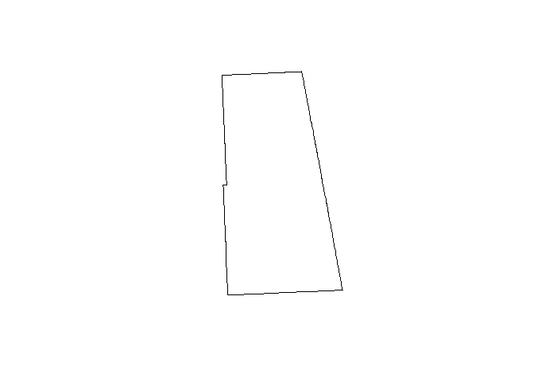
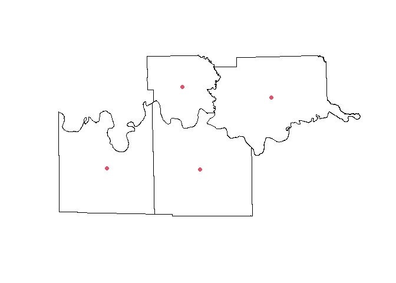
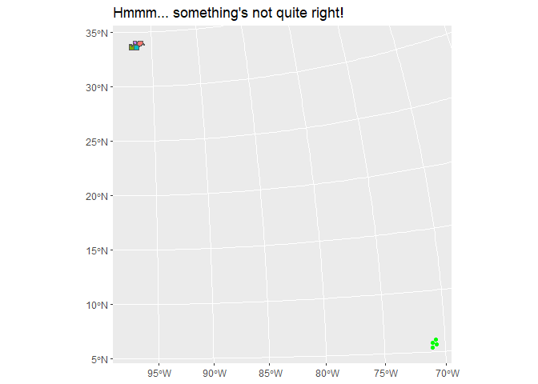
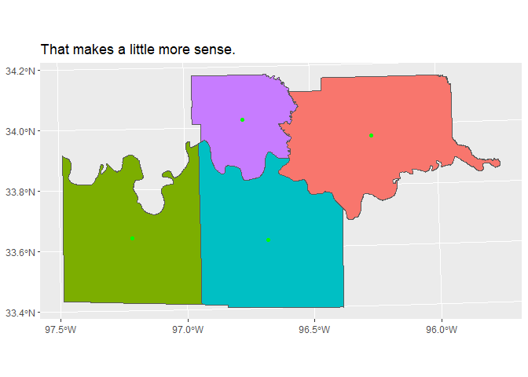

# Reading & Writing Spatial Files in R
Mike Proctor

- [Some setup first](#some-setup-first)
- [Load some TIGER Census data with the tigris
  package](#load-some-tiger-census-data-with-the-tigris-package)
- [Write a single layer to a
  geopackage](#write-a-single-layer-to-a-geopackage)
- [Writing multiple layers to a
  geopackage](#writing-multiple-layers-to-a-geopackage)
  - [Extract a list of the counties in the data
    frame](#extract-a-list-of-the-counties-in-the-data-frame)
  - [Write a function to pull each row out as a layer into the
    environment and name it according to the value in the NAME
    column](#write-a-function-to-pull-each-row-out-as-a-layer-into-the-environment-and-name-it-according-to-the-value-in-the-name-column)
  - [Apply the function to the list of county
    names](#apply-the-function-to-the-list-of-county-names)
  - [Write multiple data frames to a
    geopackage](#write-multiple-data-frames-to-a-geopackage)
    - [Loop over a list of sf data
      frames](#loop-over-a-list-of-sf-data-frames)
    - [Use lapply over a vector of
      names](#use-lapply-over-a-vector-of-names)
- [Remove layers from geopackage](#remove-layers-from-geopackage)
  - [List the layers in the geopackages we just
    wrote](#list-the-layers-in-the-geopackages-we-just-wrote)
  - [Delete one layer - should get 4
    rows](#delete-one-layer---should-get-4-rows)
  - [Delete a list of layers - deleting 2
    layers](#delete-a-list-of-layers---deleting-2-layers)
- [Shapefiles](#shapefiles)
  - [Write out a shape file](#write-out-a-shape-file)
    - [Write a file with a time stamp in filename - This works with any
      filename - csv, xlsx
      etc](#write-a-file-with-a-time-stamp-in-filename---this-works-with-any-filename---csv-xlsx-etc)
  - [Read a shape file - the one we just wrote
    out](#read-a-shape-file---the-one-we-just-wrote-out)
  - [Clean out environment and reset](#clean-out-environment-and-reset)
- [Comma Separated Values - CSV](#comma-separated-values---csv)
  - [Write to csv](#write-to-csv)
    - [Find the centroid for each county and plot
      it](#find-the-centroid-for-each-county-and-plot-it)
    - [Create columns for coordinates from geometry
      column](#create-columns-for-coordinates-from-geometry-column)
    - [Write out the file](#write-out-the-file)
    - [There’s too many columns - let’s get rid of
      some](#theres-too-many-columns---lets-get-rid-of-some)
    - [The dogbert data frame has the most useful data so lets write it
      to a
      csv.](#the-dogbert-data-frame-has-the-most-useful-data-so-lets-write-it-to-a-csv)
- [Read from a csv and convert to an sf
  object](#read-from-a-csv-and-convert-to-an-sf-object)
  - [Convert data frame with coordinate columns to sf
    object](#convert-data-frame-with-coordinate-columns-to-sf-object)
    - [That’s not what we were after!](#thats-not-what-we-were-after)

## Some setup first

*I used the “sf::” prefix on all of the functions from the sf package
just to make things a little clearer when I’m doing something
“spatial”.*

``` r
# Check if packages are installed

Package_list <- c( "tidyverse", "rprojroot", "tigris", "sf")

for (package in Package_list) {
  if (!require(package, character.only = TRUE)) {
    install.packages(package, dependencies = TRUE)
  }
  
  #library(package, character.only = TRUE)
}

rm(list = c("package", "Package_list"))

suppressPackageStartupMessages(library(tidyverse)) # Reload some libraries to cut down on verbosity
suppressMessages(library(rprojroot))
suppressMessages(library(tigris)) # Lots of layers available here
options(tigris_use_cache = TRUE)

## for rprojroot - pointers to folders in project
base_path           <- find_rstudio_root_file()                     
source_path         <- file.path(base_path, "source_data//")
csv_path            <- file.path(base_path, "csv_output//") 
dat_path            <- file.path(base_path, "dat_output//")
#plot_path          <- file.path(base_path, "plots//")                 
spatial_path        <- file.path(base_path, "spatial_output//")
```

## Load some TIGER Census data with the tigris package

<https://www.rdocumentation.org/packages/tigris/versions/2.1>

<https://github.com/walkerke/tigris/tree/master>

*Explicitly setting the crs when you load the file will save you much
frustration later on.*

``` r
# Read the data in and explicitly set the crs ------

state <- tigris::states() |> filter(STUSPS == "OK" | STUSPS == "TX")
state <- sf::st_transform(state, crs = 32614)

marshall <- tigris::counties("OK") |> filter(NAME == "Marshall")
marshall <- sf::st_transform(marshall, crs = 32614)

OK_Counties <- tigris::counties() |> filter(STATEFP == "40")
OK_Counties <- sf::st_transform(OK_Counties, crs = 32614)

TX_OK_Counties <- tigris::counties() |> filter(STATEFP == "40" | STATEFP == "48")
TX_OK_Counties <- sf::st_transform(TX_OK_Counties, crs = 32614)
```

Line 4  
Explicitly setting the crs when loaded

# Write a single layer to a geopackage

``` r
sf::write_sf(marshall, paste0(spatial_path, "one_layer.gpkg"), "Marshall")
sf::st_layers(paste0(spatial_path, "one_layer.gpkg"))
```

Line 1  
Write the layer to the file

Line 2  
List the layers in the file

<!-- -->

    Driver: GPKG 
    Available layers:
      layer_name geometry_type features fields              crs_name
    1   Marshall Multi Polygon        1     17 WGS 84 / UTM zone 14N

# Writing multiple layers to a geopackage

First off we need a bunch of layers to write

### Extract a list of the counties in the data frame

``` r
rm(list = c("marshall", "state", "TX_OK_Counties"))# These are in the way at the moment so lets get rid of them.

CountyList <- unique(OK_Counties$NAME)
CountyList
```

     [1] "Adair"        "Sequoyah"     "Canadian"     "Marshall"     "Harper"      
     [6] "Alfalfa"      "Lincoln"      "Hughes"       "Muskogee"     "Ottawa"      
    [11] "Rogers"       "Caddo"        "Mayes"        "Coal"         "Carter"      
    [16] "Greer"        "Cotton"       "McCurtain"    "Atoka"        "Okmulgee"    
    [21] "Washington"   "Seminole"     "Woods"        "Harmon"       "Kay"         
    [26] "Blaine"       "Pontotoc"     "Creek"        "Pottawatomie" "Kiowa"       
    [31] "Love"         "Noble"        "Washita"      "Jackson"      "Major"       
    [36] "Delaware"     "Custer"       "Ellis"        "Oklahoma"     "Johnston"    
    [41] "Comanche"     "Pushmataha"   "Cleveland"    "Wagoner"      "Beckham"     
    [46] "Garvin"       "Craig"        "Cherokee"     "Osage"        "Tillman"     
    [51] "Logan"        "Pittsburg"    "Jefferson"    "Pawnee"       "Okfuskee"    
    [56] "McClain"      "Le Flore"     "Beaver"       "Dewey"        "Choctaw"     
    [61] "Roger Mills"  "Bryan"        "Latimer"      "Texas"        "Woodward"    
    [66] "Stephens"     "Tulsa"        "McIntosh"     "Kingfisher"   "Grant"       
    [71] "Murray"       "Nowata"       "Haskell"      "Grady"        "Payne"       
    [76] "Cimarron"     "Garfield"    

### Write a function to pull each row out as a layer into the environment and name it according to the value in the NAME column

``` r
 Create_County_df <- function(x) { 
  df <- OK_Counties |> filter(NAME == x) |> distinct(NAME, .keep_all = TRUE)
  df_name <- paste0(x)
  assign(df_name, df, envir = .GlobalEnv)
}
```

### Apply the function to the list of county names

We only need a few data frames to demonstrate so lets filter the list
down a bit first.

``` r
ShortList <- head(CountyList, 5)
ShortList

lapply(ShortList, Create_County_df)
```

Line 1  
Take the first 5 rows

Line 4  
We could have done this with a loop but not in only one line.

<!-- -->

    [1] "Adair"    "Sequoyah" "Canadian" "Marshall" "Harper"  
    [[1]]
    Simple feature collection with 1 feature and 17 fields
    Geometry type: MULTIPOLYGON
    Dimension:     XY
    Bounding box:  xmin: 878098.7 ymin: 3951961 xmax: 910033.5 ymax: 4011037
    Projected CRS: WGS 84 / UTM zone 14N
      STATEFP COUNTYFP COUNTYNS GEOID  NAME     NAMELSAD LSAD CLASSFP MTFCC CSAFP
    1      40      001 01101788 40001 Adair Adair County   06      H1 G4020  <NA>
      CBSAFP METDIVFP FUNCSTAT      ALAND  AWATER    INTPTLAT     INTPTLON
    1   <NA>     <NA>        A 1486345553 8864932 +35.8980428 -094.6510258
                            geometry
    1 MULTIPOLYGON (((879562.1 39...

    [[2]]
    Simple feature collection with 1 feature and 17 fields
    Geometry type: MULTIPOLYGON
    Dimension:     XY
    Bounding box:  xmin: 850636 ymin: 3914018 xmax: 915069.2 ymax: 3953311
    Projected CRS: WGS 84 / UTM zone 14N
      STATEFP COUNTYFP COUNTYNS GEOID     NAME        NAMELSAD LSAD CLASSFP MTFCC
    1      40      135 01101855 40135 Sequoyah Sequoyah County   06      H1 G4020
      CSAFP CBSAFP METDIVFP FUNCSTAT      ALAND    AWATER    INTPTLAT     INTPTLON
    1  <NA>   <NA>     <NA>        A 1744553528 105073391 +35.5024345 -094.7507569
                            geometry
    1 MULTIPOLYGON (((910187.8 39...

    [[3]]
    Simple feature collection with 1 feature and 17 fields
    Geometry type: MULTIPOLYGON
    Dimension:     XY
    Bounding box:  xmin: 562118.4 ymin: 3909679 xmax: 620741.7 ymax: 3954366
    Projected CRS: WGS 84 / UTM zone 14N
      STATEFP COUNTYFP COUNTYNS GEOID     NAME        NAMELSAD LSAD CLASSFP MTFCC
    1      40      017 01101796 40017 Canadian Canadian County   06      H1 G4020
      CSAFP CBSAFP METDIVFP FUNCSTAT      ALAND   AWATER    INTPTLAT     INTPTLON
    1  <NA>   <NA>     <NA>        A 2322112748 23146754 +35.5433544 -097.9798891
                            geometry
    1 MULTIPOLYGON (((562193 3938...

    [[4]]
    Simple feature collection with 1 feature and 17 fields
    Geometry type: MULTIPOLYGON
    Dimension:     XY
    Bounding box:  xmin: 687240.8 ymin: 3744940 xmax: 726341.4 ymax: 3783739
    Projected CRS: WGS 84 / UTM zone 14N
      STATEFP COUNTYFP COUNTYNS GEOID     NAME        NAMELSAD LSAD CLASSFP MTFCC
    1      40      095 01101832 40095 Marshall Marshall County   06      H1 G4020
      CSAFP CBSAFP METDIVFP FUNCSTAT     ALAND    AWATER    INTPTLAT     INTPTLON
    1  <NA>   <NA>     <NA>        A 962153980 143719930 +34.0270069 -096.7705327
                            geometry
    1 MULTIPOLYGON (((687379.8 37...

    [[5]]
    Simple feature collection with 1 feature and 17 fields
    Geometry type: MULTIPOLYGON
    Dimension:     XY
    Bounding box:  xmin: 410268.2 ymin: 4049867 xmax: 473687.1 ymax: 4095531
    Projected CRS: WGS 84 / UTM zone 14N
      STATEFP COUNTYFP COUNTYNS GEOID   NAME      NAMELSAD LSAD CLASSFP MTFCC CSAFP
    1      40      059 01101817 40059 Harper Harper County   06      H1 G4020  <NA>
      CBSAFP METDIVFP FUNCSTAT      ALAND  AWATER    INTPTLAT     INTPTLON
    1   <NA>     <NA>        A 2689919591 5259447 +36.8003504 -099.6628052
                            geometry
    1 MULTIPOLYGON (((446982 4049...

Now we have a bunch of layers to write

## Write multiple data frames to a geopackage

There’s two approaches here.

### Loop over a list of sf data frames

``` r
for (i in ShortList) {
  # get() gets the object not the name
  # i is an object in first instance but character string in second(layer name)
  sf::write_sf(get(i), paste0(spatial_path, "OK_Counties.gpkg"), i) 
  
}
```

### Use lapply over a vector of names

Applies a function (in this case an anonymous function) to each object
within a vector( a list - ShortList).

``` r
lapply(ShortList,function(z) sf::write_sf(get(z), paste0(spatial_path, "OK_Counties2.gpkg"), z)) 
```

    [[1]]
    Simple feature collection with 1 feature and 17 fields
    Geometry type: MULTIPOLYGON
    Dimension:     XY
    Bounding box:  xmin: 878098.7 ymin: 3951961 xmax: 910033.5 ymax: 4011037
    Projected CRS: WGS 84 / UTM zone 14N
      STATEFP COUNTYFP COUNTYNS GEOID  NAME     NAMELSAD LSAD CLASSFP MTFCC CSAFP
    1      40      001 01101788 40001 Adair Adair County   06      H1 G4020  <NA>
      CBSAFP METDIVFP FUNCSTAT      ALAND  AWATER    INTPTLAT     INTPTLON
    1   <NA>     <NA>        A 1486345553 8864932 +35.8980428 -094.6510258
                            geometry
    1 MULTIPOLYGON (((879562.1 39...

    [[2]]
    Simple feature collection with 1 feature and 17 fields
    Geometry type: MULTIPOLYGON
    Dimension:     XY
    Bounding box:  xmin: 850636 ymin: 3914018 xmax: 915069.2 ymax: 3953311
    Projected CRS: WGS 84 / UTM zone 14N
      STATEFP COUNTYFP COUNTYNS GEOID     NAME        NAMELSAD LSAD CLASSFP MTFCC
    1      40      135 01101855 40135 Sequoyah Sequoyah County   06      H1 G4020
      CSAFP CBSAFP METDIVFP FUNCSTAT      ALAND    AWATER    INTPTLAT     INTPTLON
    1  <NA>   <NA>     <NA>        A 1744553528 105073391 +35.5024345 -094.7507569
                            geometry
    1 MULTIPOLYGON (((910187.8 39...

    [[3]]
    Simple feature collection with 1 feature and 17 fields
    Geometry type: MULTIPOLYGON
    Dimension:     XY
    Bounding box:  xmin: 562118.4 ymin: 3909679 xmax: 620741.7 ymax: 3954366
    Projected CRS: WGS 84 / UTM zone 14N
      STATEFP COUNTYFP COUNTYNS GEOID     NAME        NAMELSAD LSAD CLASSFP MTFCC
    1      40      017 01101796 40017 Canadian Canadian County   06      H1 G4020
      CSAFP CBSAFP METDIVFP FUNCSTAT      ALAND   AWATER    INTPTLAT     INTPTLON
    1  <NA>   <NA>     <NA>        A 2322112748 23146754 +35.5433544 -097.9798891
                            geometry
    1 MULTIPOLYGON (((562193 3938...

    [[4]]
    Simple feature collection with 1 feature and 17 fields
    Geometry type: MULTIPOLYGON
    Dimension:     XY
    Bounding box:  xmin: 687240.8 ymin: 3744940 xmax: 726341.4 ymax: 3783739
    Projected CRS: WGS 84 / UTM zone 14N
      STATEFP COUNTYFP COUNTYNS GEOID     NAME        NAMELSAD LSAD CLASSFP MTFCC
    1      40      095 01101832 40095 Marshall Marshall County   06      H1 G4020
      CSAFP CBSAFP METDIVFP FUNCSTAT     ALAND    AWATER    INTPTLAT     INTPTLON
    1  <NA>   <NA>     <NA>        A 962153980 143719930 +34.0270069 -096.7705327
                            geometry
    1 MULTIPOLYGON (((687379.8 37...

    [[5]]
    Simple feature collection with 1 feature and 17 fields
    Geometry type: MULTIPOLYGON
    Dimension:     XY
    Bounding box:  xmin: 410268.2 ymin: 4049867 xmax: 473687.1 ymax: 4095531
    Projected CRS: WGS 84 / UTM zone 14N
      STATEFP COUNTYFP COUNTYNS GEOID   NAME      NAMELSAD LSAD CLASSFP MTFCC CSAFP
    1      40      059 01101817 40059 Harper Harper County   06      H1 G4020  <NA>
      CBSAFP METDIVFP FUNCSTAT      ALAND  AWATER    INTPTLAT     INTPTLON
    1   <NA>     <NA>        A 2689919591 5259447 +36.8003504 -099.6628052
                            geometry
    1 MULTIPOLYGON (((446982 4049...

# Remove layers from geopackage

### List the layers in the geopackages we just wrote

There should be 5 layers in each file

``` r
sf::st_layers(paste0(spatial_path, "OK_Counties.gpkg"))
```

    Driver: GPKG 
    Available layers:
      layer_name geometry_type features fields              crs_name
    1      Adair Multi Polygon        1     17 WGS 84 / UTM zone 14N
    2   Sequoyah Multi Polygon        1     17 WGS 84 / UTM zone 14N
    3   Canadian Multi Polygon        1     17 WGS 84 / UTM zone 14N
    4   Marshall Multi Polygon        1     17 WGS 84 / UTM zone 14N
    5     Harper Multi Polygon        1     17 WGS 84 / UTM zone 14N

``` r
sf::st_layers(paste0(spatial_path, "OK_Counties2.gpkg"))
```

    Driver: GPKG 
    Available layers:
      layer_name geometry_type features fields              crs_name
    1      Adair Multi Polygon        1     17 WGS 84 / UTM zone 14N
    2   Sequoyah Multi Polygon        1     17 WGS 84 / UTM zone 14N
    3   Canadian Multi Polygon        1     17 WGS 84 / UTM zone 14N
    4   Marshall Multi Polygon        1     17 WGS 84 / UTM zone 14N
    5     Harper Multi Polygon        1     17 WGS 84 / UTM zone 14N

### Delete one layer - should get 4 rows

``` r
sf::st_delete(paste0(spatial_path, "OK_Counties.gpkg"), "Marshall")
```

    Deleting layer `Marshall' using driver `GPKG'

``` r
sf::st_layers(paste0(spatial_path, "OK_Counties.gpkg")) # Check to see if it worked
```

    Driver: GPKG 
    Available layers:
      layer_name geometry_type features fields              crs_name
    1      Adair Multi Polygon        1     17 WGS 84 / UTM zone 14N
    2   Sequoyah Multi Polygon        1     17 WGS 84 / UTM zone 14N
    3   Canadian Multi Polygon        1     17 WGS 84 / UTM zone 14N
    4     Harper Multi Polygon        1     17 WGS 84 / UTM zone 14N

### Delete a list of layers - deleting 2 layers

``` r
delList <- head(ShortList,2) # take the first 2 rows
lapply(delList, function(y)sf::st_delete(paste0(spatial_path, "OK_Counties2.gpkg"), y))
```

    Deleting layer `Adair' using driver `GPKG'
    Deleting layer `Sequoyah' using driver `GPKG'

    [[1]]
    [1] TRUE

    [[2]]
    [1] TRUE

``` r
sf::st_layers(paste0(spatial_path, "OK_Counties2.gpkg")) # Check to see if it worked
```

    Driver: GPKG 
    Available layers:
      layer_name geometry_type features fields              crs_name
    1   Canadian Multi Polygon        1     17 WGS 84 / UTM zone 14N
    2   Marshall Multi Polygon        1     17 WGS 84 / UTM zone 14N
    3     Harper Multi Polygon        1     17 WGS 84 / UTM zone 14N

# Shapefiles

Shapefiles are the most common format for spatial data but they have
some limitations. The format requires 4 separate files and column names
and data are limited in length. When writing to a shapefile, column
names may get truncated - this could be a problem if mulitple columns
have similar names. Each layer requires a separate set of files. Writing
the 77 layers in CountyList from above would require 4x77 files.

## Write out a shape file

### Write a file with a time stamp in filename - This works with any filename - csv, xlsx etc

*GDAL complains here because there are too many digits in the ALAND and
AWATER fields - the answer is to not use a shape file.*

``` r
timestamp <- format(Sys.time(), "%Y%m%d_%H%M")
sf::st_write(Adair, paste0(spatial_path, "Adair_County_", timestamp,".shp")) #Adair_County_20250305_1126.shp
```

    Writing layer `Adair_County_20250306_1526' to data source 
      `G:/___R___/Spatial/spatial_output/Adair_County_20250306_1526.shp' using driver `ESRI Shapefile'
    Writing 1 features with 17 fields and geometry type Multi Polygon.

    Warning in CPL_write_ogr(obj, dsn, layer, driver,
    as.character(dataset_options), : GDAL Message 1: Value 1486345553 of field
    ALAND of feature 0 not successfully written. Possibly due to too larger number
    with respect to field width

## Read a shape file - the one we just wrote out

``` r
Adair_Shape <- sf::st_read(paste0(spatial_path, "Adair_County_", timestamp,".shp")) # I cheated here - how?
```

    Reading layer `Adair_County_20250306_1526' from data source 
      `G:\___R___\Spatial\spatial_output\Adair_County_20250306_1526.shp' 
      using driver `ESRI Shapefile'
    Simple feature collection with 1 feature and 17 fields
    Geometry type: POLYGON
    Dimension:     XY
    Bounding box:  xmin: 878098.7 ymin: 3951961 xmax: 910033.5 ymax: 4011037
    Projected CRS: WGS 84 / UTM zone 14N

``` r
plot(Adair_Shape$geometry)
```



## Clean out environment and reset

We’re done with all those objects in the environment pane so let’s do
some house cleaning.  
The following code will remove the objects and reload everything that
we’ll need.

``` r
rm(list=ls())
base_path           <- find_rstudio_root_file()                     
source_path         <- file.path(base_path, "source_data//")
csv_path            <- file.path(base_path, "csv_output//") 
dat_path            <- file.path(base_path, "dat_output//")

TX_OK_Counties <- tigris::counties() |> filter(STATEFP == "40" | STATEFP == "48")
TX_OK_Counties <- sf::st_transform(TX_OK_Counties, crs = 32614)
```

# Comma Separated Values - CSV

## Write to csv

We don’t need all the rows so let’s filter some out

``` r
  TexomaList <- c("Marshall", "Bryan", "Cooke", "Grayson")
  TexomaCounties <- TX_OK_Counties |> filter(NAME %in% TexomaList)
```

Line 2  
%in% is called an “infix” symbol

### Find the centroid for each county and plot it

This will give us a set of points. Saving polygons to a csv isn’t going
to be all that useful - it would be really difficult to parse that out
and get it back into a GIS system. If you aren’t going to use the
polygon data it won’t matter.

``` r
 TexomaCentroids <- sf::st_centroid(TexomaCounties)
s <- 
plot(TexomaCounties$geometry) + 
  plot(TexomaCentroids$geometry, add = TRUE, pch = 19, col = 2)
```



### Create columns for coordinates from geometry column

Already having columns for x and y will make it much easier to import
this back into a GIS system.

### Write out the file

I use a “.dat” extension so that I know that the date columns haven’t
been modified accidentally by nosy people using excel(including myself).
Otherwise they are just a csv.

### There’s too many columns - let’s get rid of some

*I use the names of characters from the Dilbert comic strip when I can’t
come up with a meaningful data frame name.*

#### Select by column name

``` r
# Include by column name
dilbert <- Centroids |> select(STATEFP, COUNTYFP, NAME, ALAND, AWATER, northing, easting )
# Exclude by column name
wally <- Centroids |> select(-CBSAFP, -CLASSFP, -COUNTYNS, -CSAFP, -FUNCSTAT, -GEOID, -INTPTLAT,
                             -INTPTLON,-METDIVFP,-MTFCC,-NAMELSAD, -LSAD )
```

#### Select by a list of column names

In this case I’m deleting everything in the list - if I remove the “-”
in front of “all_of” I’d keep everything in the list.

``` r
delList <-  c("CBSAFP", "CLASSFP", "COUNTYNS", "CSAFP", "FUNCSTAT", "GEOID", "INTPTLAT",
             "INTPTLON","METDIVFP","MTFCC","NAMELSAD", "LSAD" )
alice <- Centroids |> select(-all_of(delList))
```

#### Select by index (location)

Be careful with indexing columns. If for some reason the number of
columns, or order of columns changes upstream, it will wreak havoc on
your data frame.

I use indexing when I first load a data frame - sometimes its easier to
index a column than to type some bizarre column name.

If the data frame is already in some type of workflow where the columns
could change, I avoid indexing. But by then I’ve changed the column name
to something reasonable anyway.

``` r
# Include by index
dogbert <- Centroids |> dplyr::select(1,5,14:19)

# Exclude by index
ratbert <- Centroids |> dplyr::select(-2:-4, -6:-13)
```

### The dogbert data frame has the most useful data so lets write it to a csv.

I’m using the same name with a time stamp so it won’t overwrite what we
did previously. It might be worthwhile to compare the files. Time stamps
in file names are sometimes useful and other times not so much. Early in
a project when I’m making lots of changes to the data I use them. Once I
get downstream projects going that use the data, I take the time stamp
off, so I don’t have to change the file name every time I reload it in
downstream scripts.

``` r
timestamp <- format(Sys.time(), "%Y%m%d_%H%M")
write_csv(dogbert, paste0(csv_path, "TexomaCountyCentroids", "_", timestamp, ".csv"))
write_csv(dogbert, paste0(dat_path, "TexomaCountyCentroids", "_", timestamp, ".dat")) 
```

# Read from a csv and convert to an sf object

I used “Import Dataset” here because the file name was so long and my
typing is so bad.

``` r
CountyCentroids <- read_csv(paste0(csv_path, "TexomaCountyCentroids_20250303_1434.csv"), 
                         col_types = cols(INTPTLAT = col_number(), 
                                          INTPTLON = col_number(), 
                                          northing = col_number(), # these cols need to be numeric
                                          easting = col_number()))
```

## Convert data frame with coordinate columns to sf object

``` r
fred <- CountyCentroids |> sf::st_as_sf(coords=c("northing","easting"), crs=32614)

plot_name<- 
  ggplot() +
  geom_sf(data = TexomaCounties, aes(fill = NAME)) +
  geom_sf(data = fred, color = "green") +
  theme(legend.position = "none") +
  ggtitle(paste0("Hmmm... something's not quite right!")) 

print(plot_name)
```



### That’s not what we were after!

Make sure you get x and y coords in right order

``` r
fred <- CountyCentroids |> 
  sf::st_as_sf(coords=c("easting","northing"), crs=32614)

plot_name<- 
  ggplot() +
  geom_sf(data = TexomaCounties, aes(fill = NAME)) +
  geom_sf(data = fred, color = "green") +
  theme(legend.position = "none") +
  ggtitle(paste0("That makes a little more sense.")) 

print(plot_name)
```

Line 2  
Switched position of “easting” and “northing”



------------------------------------------------------------------------

Additional challenges:

These counties were intended to be those that surround Lake Texoma. One
could argue that since I included Cooke county in the southwest I should
probably include the county to the north of it as well (Love). How would
you go about fixing that?

There are a couple of columns in dogbert that look like lat/long
coordinates - I wonder if they are centroids that were already in the
TIGER data? How would you go about sorting that out?

There’s two more columns that look like they contain area values for
land and water. I don’t know what the units are but I suspect they might
be square meters. How would you go about creating columns that converted
those values to acres and square miles?

------------------------------------------------------------------------
